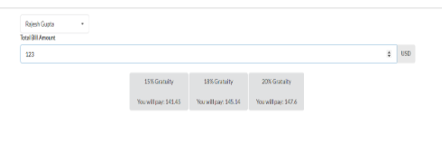
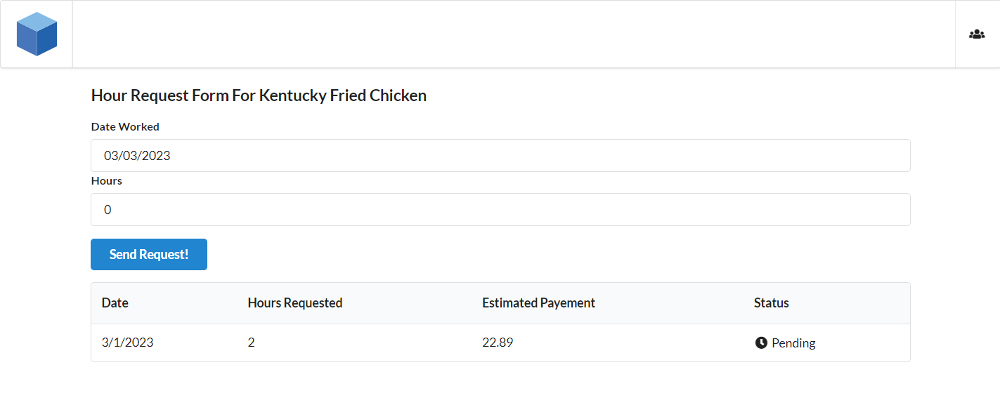
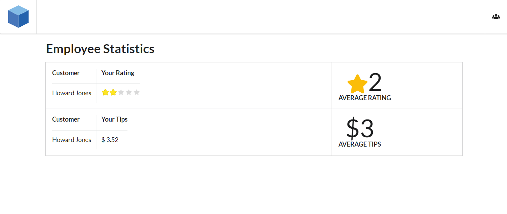
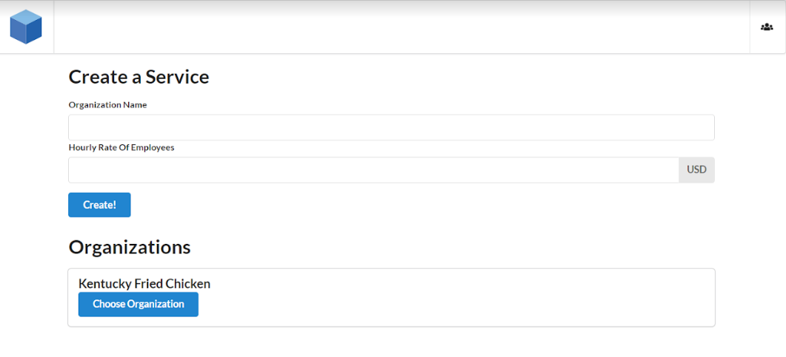
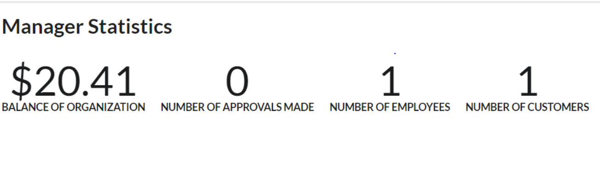

<a href="./index.html">Introduction</a>&nbsp;&nbsp;&nbsp;&nbsp;&nbsp;<a href="./methodology.html">Methodology</a>&nbsp;&nbsp;&nbsp;&nbsp;&nbsp;<a href="./demo.html">Demo</a>&nbsp;&nbsp;&nbsp;&nbsp;&nbsp;<a href="./about-us.html">About Us</a>

# Using the App

Currently our app only works if you have a metamask account since this is a way to interact with the ethereum blockchain with little to no work.
1. Download [Metamask](https://metamask.io/download/) 
2. Create an Account
3. You should be prompted to a screen like this.
   
**Make sure to switch your network to the Goerli Test Network**
 
5. Optionally if you wish to use actions in our app like sending ratings, tips, etc. You must load your account with test ether. In order to do so go to to a [faucet](https://goerlifaucet.com/) and paste your public address from metamask which is the highlighted value in the image below.
     
6. Head to our [website](https://servicechain-io.vercel.app/) and click signup to create your own account and use the app! 

Below you will get a walkthrough tutorial of the customer, employee, and user interfaces and can access our interactive react based front end [here](https://servicechain-io.vercel.app/) to try out the different functionalities yourself. The respective login credentials are given with each actor's section. 

## Actors 
* The company has the primary responsibility of setting up the instance of the factory contract where most of the services will take place and has the latter responsibility of monitoring and verifying employee submitted hours 
* The customer scans a QR code presented by a service worker to access Servicechain.io, select the according factory, and has access to tipping and rating functions for the employee who served them
* The employee can input their work hours and access the tips and ratings recieved by customers 

## Customer Experience 
Once a customer logs in and choose the business to interact with: 
> [Application](https://servicechain-io.vercel.app/)
>
> test username: sr@gmail.com
> 
> test password: password 

* Tip the service worker in ethereum that is transferred instantaneously
* Pay the bill which is automatically received by business
* Give the service worker a rating from 1-5 stars

## Employee Experience 
Once an employee logs in they have access to: 
> [Application](https://servicechain-io.vercel.app/)
>
> test username: je@gmail.com
> 
> test password: password 

* Logging table where they can enter work hours/day of week
* Performance dashboard with aggregate stats on their average rating and total tips
* All customer names with their ratings and tips 

## Manager Experience 
Once a manager logs in they have access to: 
> [Application](https://servicechain-io.vercel.app/)
>
> test username: jm@gmail.com
> 
> test password: password 

* The ability to approve hours requested by employees 
* The ability to create a new business/warehouse 
* A performance dashboard axposed to aggregate statistics on the business
> * Total balance
> * Number of approvals made
> * Detailed performance of each employee (average star rating, tips)

[back](./)

