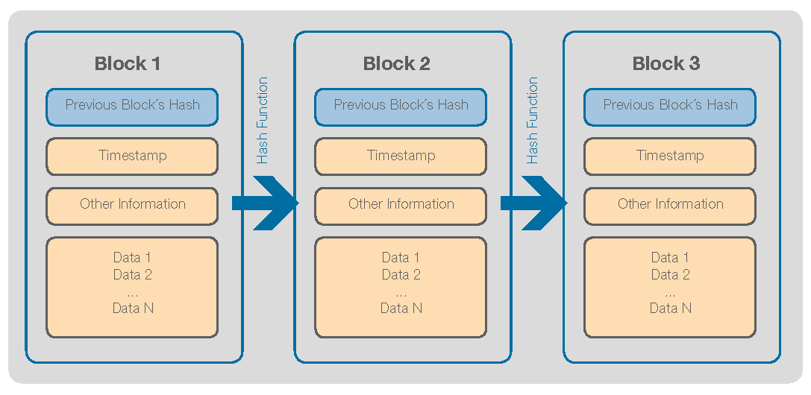

[Methodology](./methodology.html)                              [Demo](./demo.html)                           [About Us](./about-us.html)

# Introduction

Over the past fifty years, the advent of service workers has grown more and more popular. In the United States specifically, tipping culture has increased and proven to be a steady flow of income for service workers. However, with today’s digital environment, building a credible professional reputation does not have many infallible platforms or applications. Especially in the service industry, it is hard to quantify tips, customer sentiment, and experience to carry on in a professional future.

### Current methodologies of building that professional identity in the service industry are: 

*   Customer reviews (Yelp) 
*   Tips (Square)
*   Hour logging (Paycom)
*   Letters of recommendation

In the decentralization of society, it is imperative that a decentralized solution to migrate service workers’ workflows exists.

## Why Blockchain? 

With the exponential growth and influx of data usage across platforms and domains, there has also been a set of vulnerabilities regarding the physical lifespan of data, business oriented responsibility of data, data authentication and deepfakes, as well as depreciation in value of personal data. A common-ground solution to these faults has been the emergence of a decentralized system, widely known as the blockchain. The blockchain acts as an immutable digital ledger that utilizes ‘nodes’ or computers across an entire network to secure first party data and exchange information. 

And the combination of this chaining structure with proof of work/stake methodologies increase the security, transparency, and traceability of data which allows people to have more trust that what is stored on the blockchain is accurate.

### Specific attributes of the blockchain 

* Immutable Nature
> Chaining makes it hard for individuals to change/tamper with past records
> Outputs reflected through blockchain automatically gain a good ethos and credibility
* Persistence of Data 
> Chaining and replication makes it hard for data to be lost
> Graph structure of blockchain allows data to be easily queried
* Timestamping Attributes 
> Easily access records according to time of entry
> Analyze trends and patterns of specific features 

