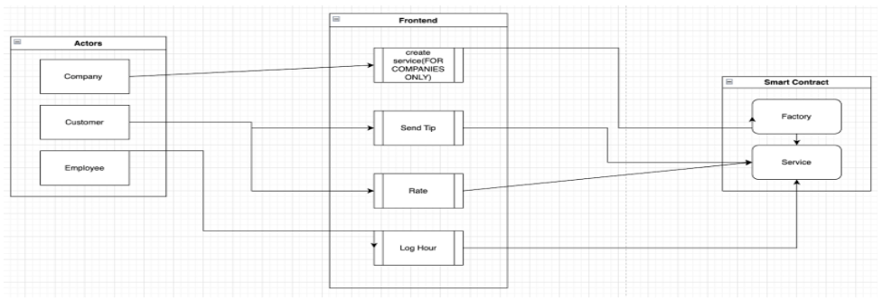

[back](./)
### Methodology

Conducted on the blockchain, smart contracts are self-executing programs based on an if-then logic that are intended to control legally relevant events and actions. They allow us to apply blockchain to create different sets of services.For Servicechain.io, there are two primary smart contracts that interact with a react based front end to create the decentralized application (dAPP for short). 

## Factory Smart Contract 
This is a parent for the _Service_ contract enables companies to create individually deployed contracts in which their employees can interact with data
the company has the primary responsibility of setting up the instance of the factory contract

> _createService_ is a function that creates an instance of the Service contract for a given instance of the Factory contract. This allows the data for a specific “factory” (company) to be separate from other companies and enables the blockchain to be less cluttered with simultaneous amounts of transactions occurring

## Service Smart Contract 
The second contract is Service which enables the set of services that empower the application which includes the functions _submitTip, sendRatings, getRatings, enterHours,_ and _getTotalHours_. 

> * _submitTip_ is a function that allows customers to transfer money from their wallet to the wallet of the employee
> * _sendRatings_ allow a customer to give a rating to an employee
> * _getRatings_ allow an employee to view the average ratings they have received from customers
> * _enterHours_ allow an employee to enter their current hours worked for an arbitrary time frame
> * _getTotalHours_ allow an employee to view their total hours they have worked since they started using the system

These six functions represent the core functionalities of our decentralized web application and  allow us to create a service based application on the blockchain. 

## App Structure 
The _Factory_ and _Service_ smart contracts work with a custom built front end to enable the decentralized application. The front end is built using React.js, Next.js, as well as some basic Javascript. Below you can see the pipeline of our application making use of all of these technologies and can test these functionalities out by accessing our [demo](./demo.html). 

## Data Usage 
In the application of smart contracts, there is no data heavy process that involves cleaning, analysis, and modeling like many data driven projects. Many smart contracts do not rely on any data, and instead require data unique to users which will grow as more and more users use the product (the blockchain acquiring more data as time goes on). Within the Servicechain.io application, users data helps craft the blockchain from which much of the value of the application derives. That is, as more and more users use the application, more data regarding average tips, average ratings, and total hours worked are available to the user in the application.
> With this data our application will be able to provide real time statistics to both the employees and managers of companies articulated in a performance dashboard form and allowing incentivized rewards such as NFT certifications. 
